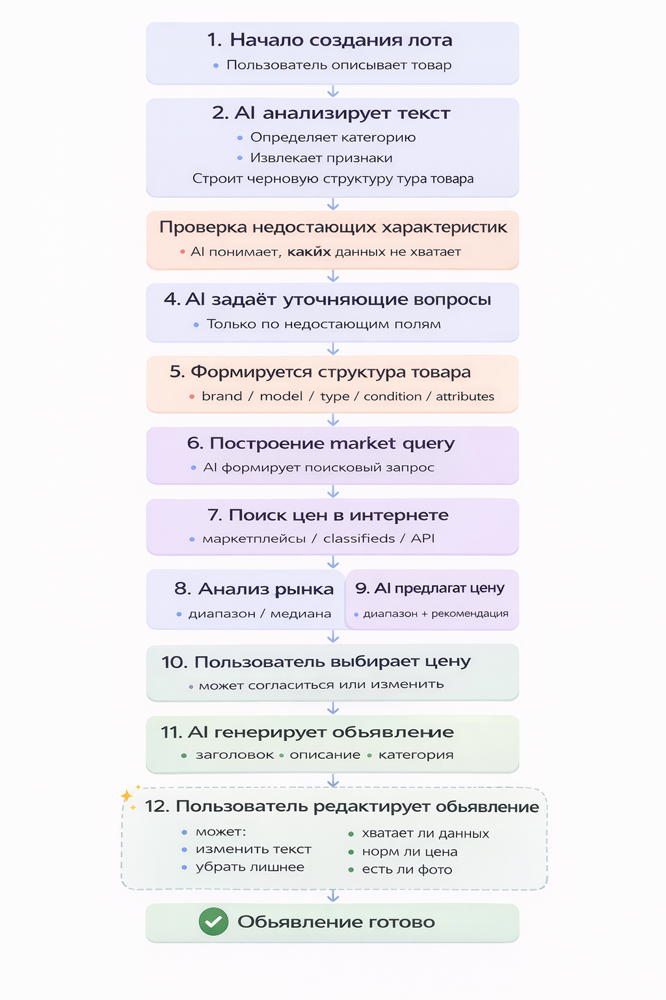
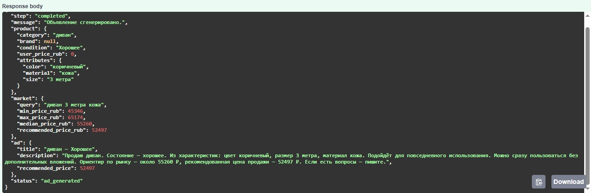
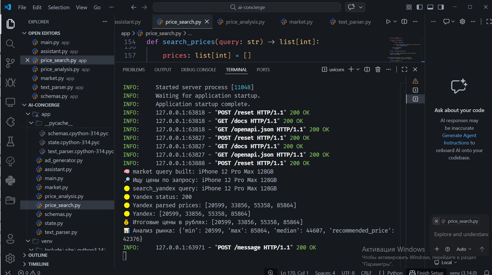
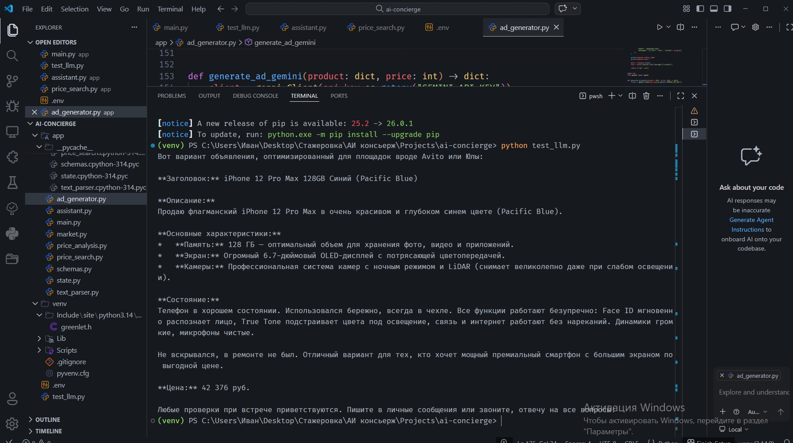
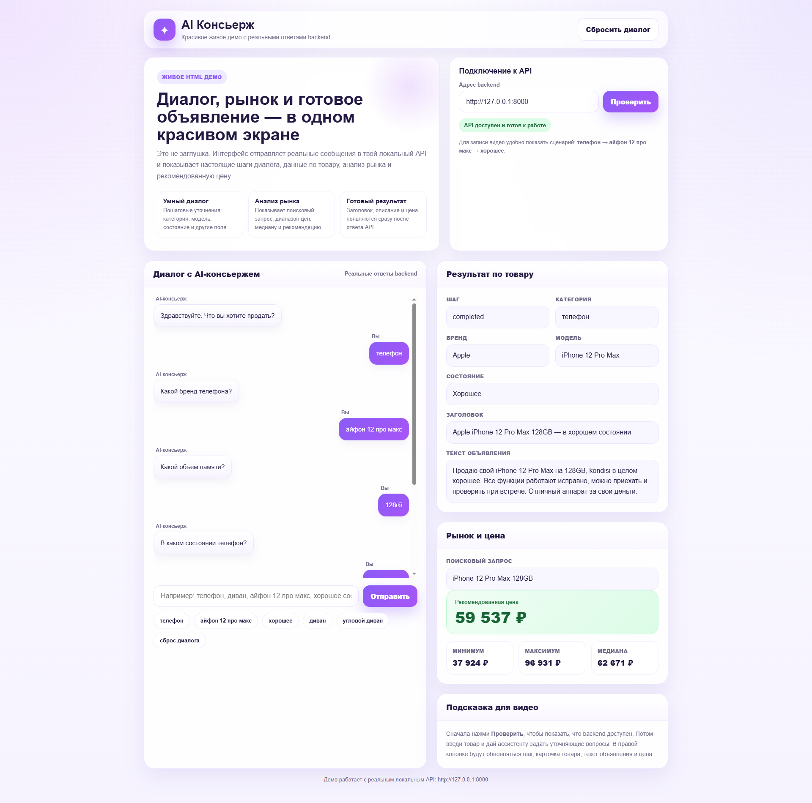
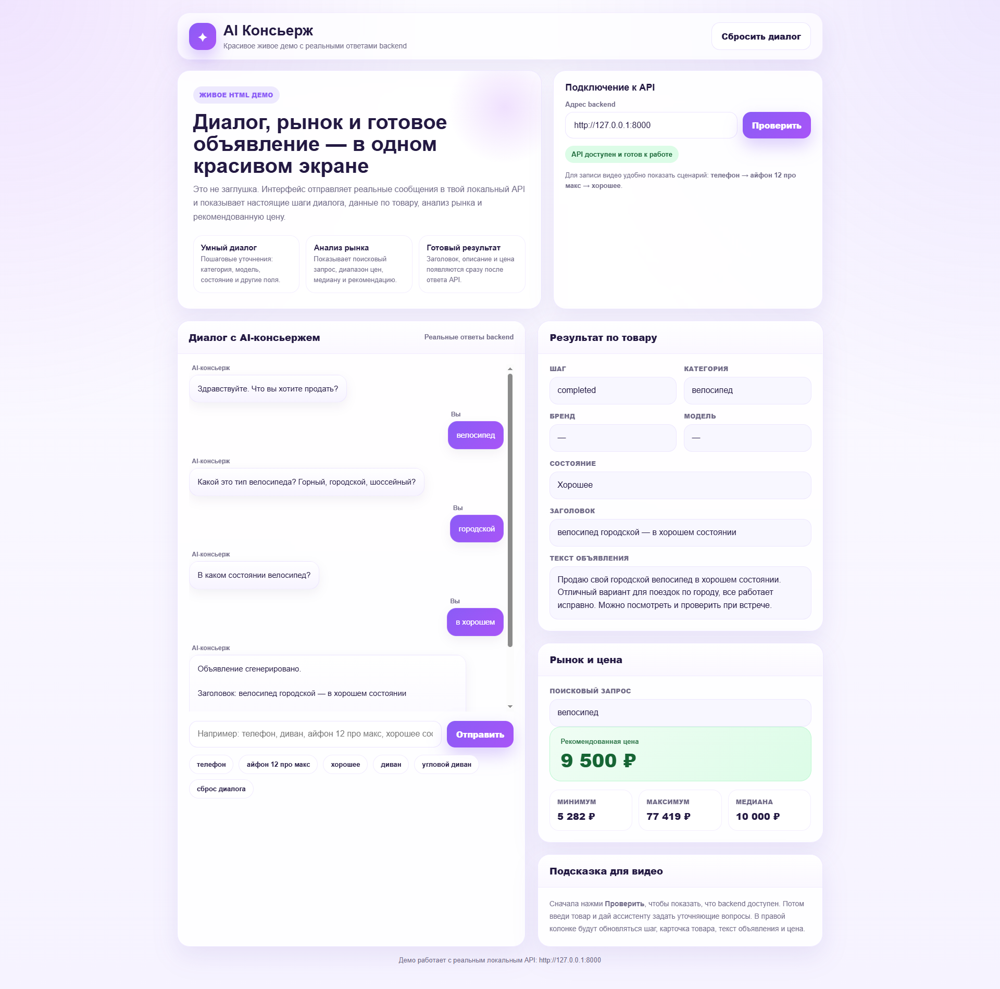
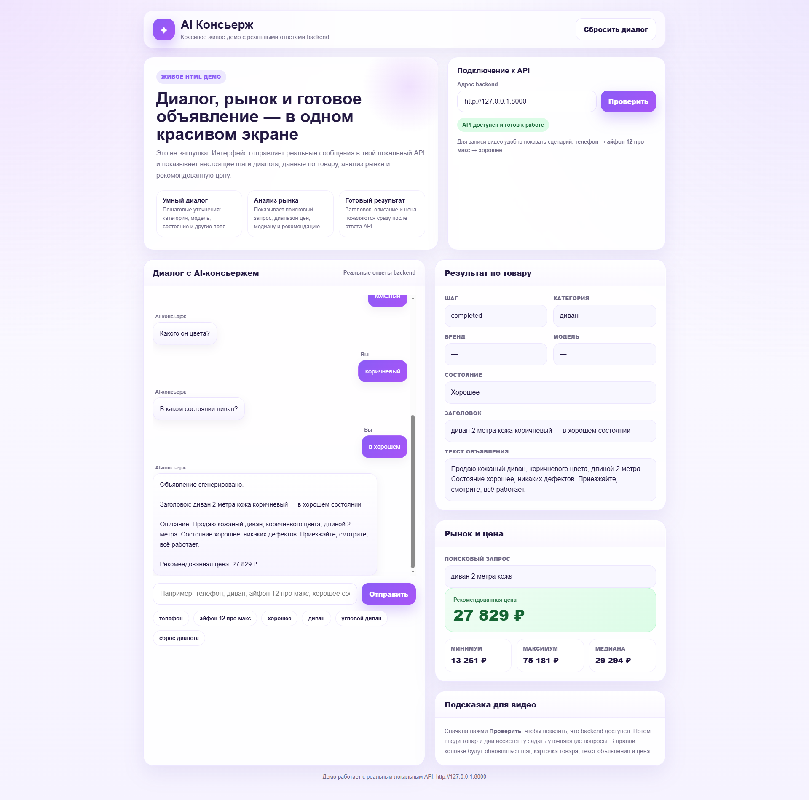

# AI Concierge

MVP-сервис для автоматического создания объявлений о продаже товара.

Проект принимает текстовое описание от пользователя, извлекает характеристики товара, ищет цены в интернете, анализирует рынок, предлагает рекомендуемую цену и генерирует готовое объявление.

## 📌 Что умеет сервис

- анализирует текстовое описание товара
- извлекает структуру товара
- формирует поисковый запрос
- собирает цены
- считает min / max / median / recommended price
- генерирует заголовок и описание объявления
- поддерживает интерактивный диалог через веб-интерфейс (AI-консьерж)

## 🧠 Архитектура процесса

## 📸 Примеры работы

### Swagger API
Интерфейс для отправки запроса и получения результата:

### Логи в терминале
Процесс поиска цен и анализа рынка:

### Результат генерации объявления
Готовый текст объявления с рекомендованной ценой:

## 🌐 Веб-интерфейс AI-консьержа

В проект добавлен браузерный HTML-интерфейс для демонстрации полного пользовательского сценария.

Интерфейс позволяет:
- вести диалог с AI-консьержем
- по шагам собирать характеристики товара
- видеть структуру товара в реальном времени
- получать готовое объявление
- смотреть анализ рынка и рекомендованную цену

### Пример: телефон

### Пример: велосипед

### Пример: мебель

## 🚀 Запуск веб-интерфейса

После запуска backend можно открыть HTML-интерфейс локально.

### 1. Запустить backend

uvicorn app.main:app --reload

### 2. Запустить простой HTTP-сервер

python -m http.server 5500

### 3. Открыть в браузере

http://127.0.0.1:5500/index.html

⚠️ Важно:

backend должен быть запущен
API адрес: http://127.0.0.1:8000

🛠 Используемые технологии
Python 3.14
FastAPI — API сервер
Uvicorn — запуск сервера
requests — HTTP-запросы
OpenRouter API — генерация текста (LLM)
Pydantic — валидация данных
python-dotenv — работа с переменными окружения
💻 Среда разработки
Windows 10/11
VS Code
PowerShell
Git / GitHub
🚀 Как запустить проект
# 1. Создать виртуальное окружение и активировать
python -m venv venv

# Активировать (Windows)
venv\Scripts\activate

# 2. Установить зависимости
pip install -r requirements.txt

# 3. Создать файл .env (в корне проекта)
OPENROUTER_API_KEY=your_api_key_here

# 4. Запустить сервер
uvicorn app.main:app --reload

# 5. Открыть Swagger
http://127.0.0.1:8000/docs
👨‍💻 Автор

Иван — QA Engineer и Developer
Проект разработан как pet-project с упором на практическое применение AI в e-commerce